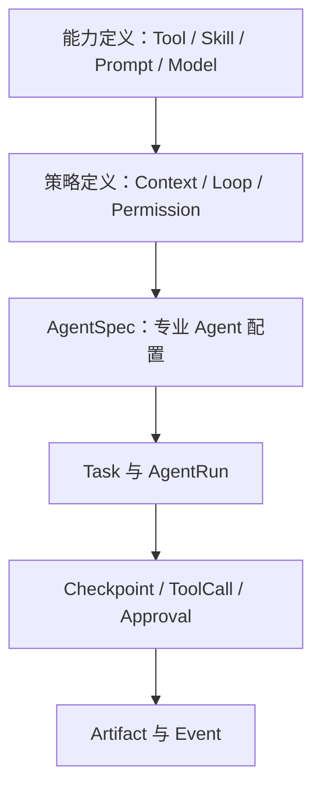
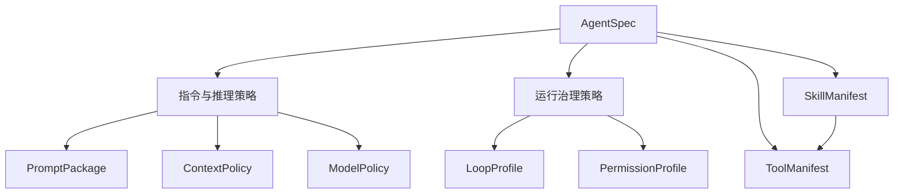
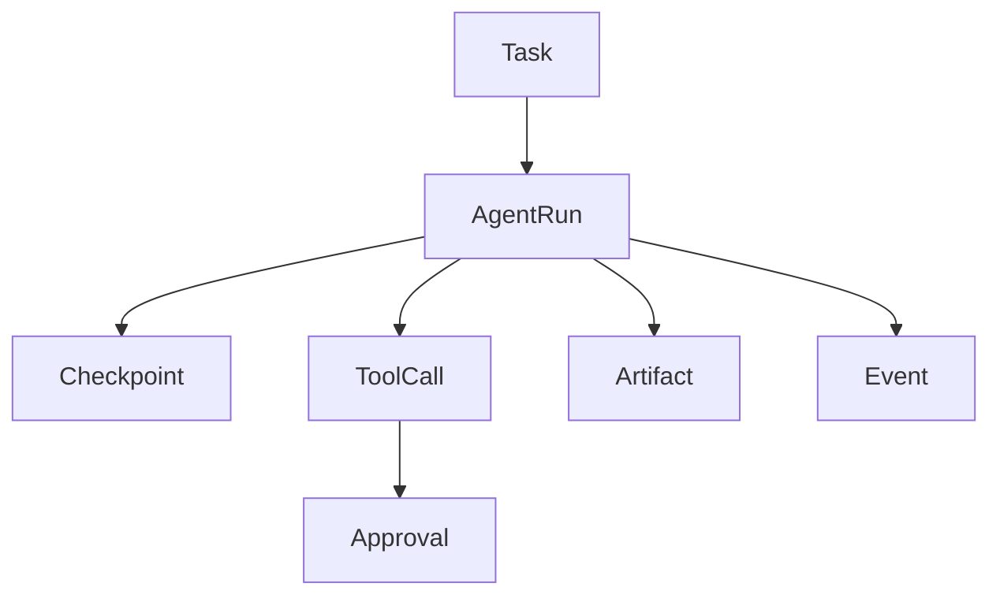
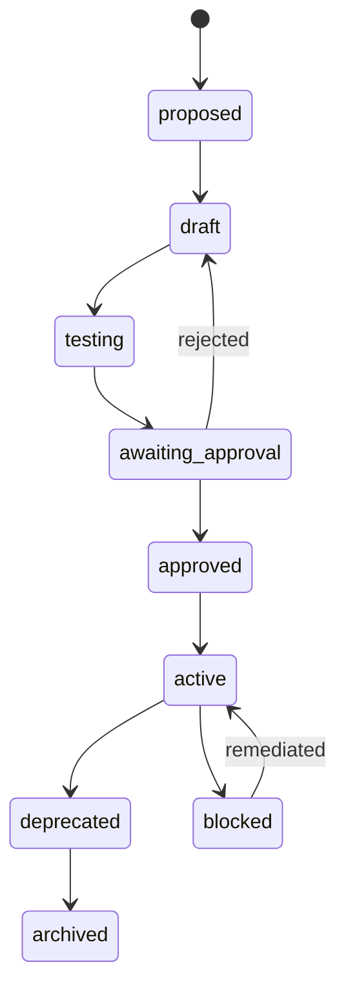

# B0 Agent 底层对象与协议详细设计方案

> 文档版本：`0.3.0-rc.1`  
> 文档状态：`Review Candidate`（架构基线已冻结，合同包修订待最终评审）  
> 初始生成日期：`2026-08-24`  
> 最近修订日期：`2026-08-29`  
> 适用范围：个人优先、预留多用户与多租户  
> 核心技术方向：Python、LangGraph、Agent Skills、OpenClaw TypeScript 适配

---

## 文档目的

本文定义 Agent 底层平台 B0 阶段的统一对象、协议、状态机、版本规则、关联关系和验收标准。B0 只解决“平台中的对象是什么、如何表达、如何关联、如何演进”，不进入数据库物理表、消息队列选型、微服务接口实现或业务 Agent 开发。

B0 完成后，B1～B5 必须以本文定义的契约为基础：

- B1：能力注册中心；
- B2：状态与持久化；
- B3：Context Engine；
- B4：Agent Harness；
- B5：Loop Engine；
- B6：参考 Agent 与上层领域 Agent。

---

# 设计边界

## B0 包含

- 统一资源信封；
- 身份、租户、项目和作用域引用；
- 15 个核心对象及公共值对象；
- 对象 ID、版本、修订号和内容摘要；
- Schema 规范；
- 对象生命周期；
- 对象间引用与解析规则；
- 权限决策模型；
- 状态机和事件模型；
- 错误模型；
- 幂等、重试与副作用规则；
- 安全、审计和多租户不变量；
- B0 验收标准。

## B0 不包含

- 具体数据库表结构；
- PostgreSQL 索引和分区设计；
- NATS、RabbitMQ 或其他消息系统选型；
- REST、gRPC、MCP、ACP 的最终接口实现；
- Kubernetes YAML；
- OpenClaw—Hermes 的具体适配代码；
- LangGraph 业务 Graph；
- 编程、内容、学习领域 Agent 的完整实现；
- 自动生成 Skill 的生产实现。

---

# 已冻结的架构决策

| ID | 决策 |
|---|---|
| D-01 | 常驻 Worker，按任务创建 Agent Run，不保存跨任务的常驻模型上下文 |
| D-02 | 使用 Agent Skills 开放格式作为 Skill 可移植标准 |
| D-03 | Hermes 可以提出 Skill，但新 Skill 默认必须人工审核后生效 |
| D-04 | Tool 与 Skill 独立存储，通过 Registry 建立多对多关系 |
| D-05 | 使用 Git、Registry Database、Object Storage 三层存储；本地缓存不构成事实来源 |
| D-06 | 先完成 B0～B5，再大规模创建专业 Agent |
| D-07 | 底层主要使用 Python，OpenClaw 作为独立 TypeScript 服务适配 |
| D-08 | 少量稳定领域 Agent 负责身份、权限、记忆和职责，大量 Skill 提供任务级专业化 |
| D-09 | Prompt、Context、Skill、Tool、Harness、Loop、Graph 必须保持独立职责 |

---

# 总体设计原则

## 单一事实来源

每类数据必须有且只有一个权威写入者。Registry 负责定义对象元数据，Git 负责源码与审查历史，Object Storage 负责不可变发布包，运行时数据库负责 Task、Run、Checkpoint 等动态状态。

## 声明与执行分离

- `AgentSpec` 声明 Agent 应该如何运行；
- Harness 负责强制执行；
- Prompt 和 Skill 不能自行扩大权限；
- 模型输出只是建议，不是授权决定；
- Registry 中的声明不能替代运行时校验。

## 定义对象不可变

已经发布的 Agent、Skill、Tool、Prompt、Policy 和 Loop 版本不得原地修改。任何内容变化必须产生新版本和新内容摘要。

## 运行状态可恢复

Worker 不保存唯一状态。Task、AgentRun、Checkpoint、Approval、ToolCall 和 Artifact 必须外置持久化，确保 Worker 重启后能够恢复。

## 权限最小化

最终权限取用户、租户、Agent、Skill、Task、环境和 Tool 要求的交集；任何显式拒绝优先于允许。

## 大对象引用化

大型 Prompt、Context 快照、模型输出、Tool 输出、文档、代码、图片和视频不得直接嵌入核心状态对象，必须通过 `ArtifactRef` 引用。

## Context 是有限预算

Context Engine 必须进行筛选、排序、压缩、去重、脱敏和 Token 预算控制，不允许把全部 Memory、Skill、Tool Schema 和知识库内容无差别注入模型。

## Skill 默认不可信

Skill 中的自然语言可能包含提示注入，脚本可能产生真实副作用。任何 Skill 在执行前必须经过状态、来源、权限、摘要和环境校验。

## 可观测性默认开启

每个 Task、Run、Checkpoint、ToolCall、Approval 和 Artifact 都必须能通过 `trace_id`、`span_id` 和事件序列追踪。

---

# 逻辑分层

| 层级 | 主要对象 | 职责 |
|---|---|---|
| L0 基础契约 | Common Types、Resource Envelope | ID、作用域、版本、引用、错误、事件 |
| L1 能力定义 | Tool、Skill、Prompt、ModelPolicy | 描述平台可用能力 |
| L2 运行策略 | ContextPolicy、LoopProfile、PermissionProfile | 描述能力如何受控使用 |
| L3 Agent 定义 | AgentSpec | 组合能力与策略形成专业 Agent |
| L4 运行状态 | Task、AgentRun、Checkpoint、ToolCall、Approval | 保存一次任务执行的真实状态 |
| L5 产物与事件 | Artifact、Event | 保存大对象、审计和异步事实 |



---

# 统一术语

| 术语 | 定义 |
|---|---|
| Agent | 由职责、Prompt、Context、Tool、Skill、权限、模型和 Loop 组合形成的任务执行角色 |
| Agent Run | Agent 对一个 Task 的一次有界执行实例 |
| Worker | 常驻进程或容器，从任务队列获取任务并创建 Agent Run |
| Tool | 具有结构化输入输出的原子可执行能力 |
| Skill | 可移植、按需加载的程序性知识与任务 SOP |
| Prompt Package | 版本化的稳定指令集合 |
| Context Package | 为某次模型调用动态组装的最小上下文快照 |
| Harness | 强制执行模型、工具、权限、预算、审批、沙箱和审计规则的运行环境 |
| Loop | 有明确观察、验证、停止和预算条件的迭代策略 |
| Graph | 多节点、分支、并行、汇合、暂停和恢复的工作流拓扑 |
| State | 当前 Task 或 Run 的可变业务状态 |
| Memory | 跨会话保存的稳定事实、偏好与经验 |
| Artifact | 文档、代码、模型输出、日志、图片、视频等大型不可变产物 |
| Registry | 定义对象的元数据、版本、状态和关联关系事实来源 |

---

# 通用 Schema 规范

## Schema 标准

- 规范格式：JSON Schema Draft 2020-12；
- API 文档兼容：OpenAPI 3.1；
- Python Schema 参考实现必须采用 Pydantic v2；
- 时间：UTC、RFC 3339；
- 枚举值：小写蛇形命名；
- 属性名：`snake_case`；
- 资源种类：大驼峰命名；
- 所有未知字段默认拒绝，除非对象明确声明扩展点；
- 所有跨对象引用必须使用强类型 Ref，不允许用自由文本拼接 ID。

## 统一资源信封

定义对象和运行对象都采用统一资源信封：

```yaml
api_version: agent-platform/v1alpha1
kind: AgentSpec
metadata:
  id: agt_0198f6d0-7ef0-7b0e-a0d3-5f9c96c7f411
  key: programming-agent
  namespace: personal
  version: 1.0.0
  revision: 1
  scope:
    type: user
    tenant_id: ten_default
    user_id: usr_owner
  labels:
    domain: development
  annotations: {}
  content_digest: sha256:...
  created_at: 2026-08-24T00:00:00Z
  created_by:
    actor_type: user
    actor_id: usr_owner
spec: {}
status: {}
```

## ID 规则

内部 ID 必须使用带类型前缀的 UUIDv7：

| 对象 | 前缀 |
|---|---|
| Tenant | `ten_` |
| User | `usr_` |
| Project | `prj_` |
| AgentSpec | `agt_` |
| SkillManifest | `skl_` |
| ToolManifest | `tol_` |
| PromptPackage | `prm_` |
| ModelPolicy | `mpo_` |
| ContextPolicy | `cpo_` |
| LoopProfile | `lop_` |
| PermissionProfile | `pep_` |
| Task | `tsk_` |
| AgentRun | `run_` |
| Checkpoint | `ckp_` |
| ToolCall | `tcl_` |
| Approval | `apr_` |
| Artifact | `art_` |
| Event | `evt_` |

人类可读的 `key` 不作为数据库主键。`namespace + key + version` 形成定义对象的逻辑唯一键。

## 版本与修订

必须区分四种版本：

| 字段 | 用途 |
|---|---|
| `api_version` | Schema 兼容版本 |
| `metadata.version` | 定义对象的语义版本，如 `2.1.0` |
| `metadata.revision` | 同一记录的乐观并发修订号 |
| `content_digest` | 对不可变规范化内容计算的 SHA-256 摘要 |

定义对象使用 Semantic Versioning：

- Major：不兼容的输入输出、权限或语义变化；
- Minor：向后兼容的新能力；
- Patch：不改变契约的修正。

运行对象不使用语义版本，以 `revision`、状态变更和事件序列管理。

## 作用域

```yaml
scope:
  type: system | tenant | user | project | session
  tenant_id: ten_default
  user_id: usr_owner
  project_id: prj_demo
  session_id: ses_optional
```

作用域解析顺序：

```text
显式绑定 > session > project > user > tenant > system
```

同名 Skill 或 Prompt 只能选择一个最终版本，不允许隐式合并正文。权限中的 `deny` 不遵循覆盖规则，而是在所有作用域中始终优先。

## 通用引用类型

```yaml
resource_ref:
  kind: SkillManifest
  id: skl_...
  version: 1.2.0
  digest: sha256:...
```

引用规则：

- 生产运行必须解析为精确版本和摘要；
- `latest` 只能用于管理端查询，不能写入 AgentRun 快照；
- 运行开始后不得无提示切换依赖版本；
- 新 AgentRun 创建时，只允许解析状态为 `active` 的定义对象；
- 已存在 AgentRun 从 Checkpoint 恢复时，允许继续使用该 Run 已冻结的 `active` 或 `deprecated` 精确版本；
- `blocked` 定义对象在新建和恢复场景中都必须失败关闭，并按风险策略暂停或终止 Run；
- `archived` 定义对象不得自动恢复，必须创建受控迁移 Run 或明确终止；
- 无法解析、精确版本不匹配或摘要不一致时必须失败关闭。

## SecretRef

任何定义或运行对象禁止保存 Secret 明文，只能保存引用：

```yaml
secret_ref:
  provider: vault
  key: tenants/ten_default/github
  version: 4
  field: token
```

Secret 只允许在 Harness 或 Tool Runtime 中解析，不进入 Prompt、Context、Event Payload 或普通日志。

## TraceContext

```yaml
trace:
  trace_id: 32-hex
  span_id: 16-hex
  parent_span_id: 16-hex-or-null
  correlation_id: corr_...
```

---

# 设计对象关系

## 定义对象关系



## 运行对象关系



---

# 核心对象设计

## AgentSpec

### 职责

定义一个稳定专业 Agent 的职责、边界和所有运行依赖。AgentSpec 是声明，不保存当前会话、任务进度或模型上下文。

### 关键字段

| 字段 | 类型 | 必填 | 说明 |
|---|---|---:|---|
| `purpose` | string | 是 | Agent 解决的问题 |
| `domain` | string | 是 | 所属业务领域 |
| `goals` | string[] | 是 | 可执行目标 |
| `non_goals` | string[] | 是 | 明确不负责的内容 |
| `input_schema_ref` | SchemaRef | 是 | Task Payload 契约 |
| `output_schema_ref` | SchemaRef | 是 | 最终结果契约 |
| `prompt_package_ref` | ResourceRef | 是 | 固定 Prompt |
| `context_policy_ref` | ResourceRef | 是 | Context 组装策略 |
| `model_policy_ref` | ResourceRef | 是 | 模型选择策略 |
| `loop_profile_ref` | ResourceRef | 是 | 默认 Loop |
| `permission_profile_ref` | ResourceRef | 是 | 权限上限 |
| `skill_bindings` | Binding[] | 否 | 允许使用的 Skill |
| `tool_bindings` | Binding[] | 否 | 直接允许的 Tool |
| `memory_policy` | object | 是 | 记忆读取和写入范围 |
| `budget_defaults` | Budget | 是 | 默认成本限制 |
| `approval_defaults` | object | 是 | 默认审批规则 |
| `concurrency_policy` | object | 是 | 并发和串行约束 |
| `eval_suite_refs` | ArtifactRef[] | 是 | 上线前评估集及其不可变内容摘要 |

### 不变量

- 必须同时声明目标和非目标；
- 必须引用精确版本的 Prompt、Policy 和 Loop；
- AgentSpec 权限不得超过所属租户上限；
- Skill 的工具要求必须是 Agent 工具权限的子集；
- `active` AgentSpec 引用的所有定义对象必须处于 `active`；
- AgentSpec 更新不得影响已经启动的 AgentRun。

### 示例

```yaml
kind: AgentSpec
metadata:
  key: programming-agent
  version: 1.0.0
spec:
  purpose: 在受控代码仓库中完成编程任务
  domain: development
  goals:
    - 分析代码库并完成结构化开发任务
    - 运行测试并提供可验证结果
  non_goals:
    - 未经审批部署生产环境
    - 访问非任务授权仓库
  input_schema_ref: {id: sch_programming_task, version: 1.0.0}
  output_schema_ref: {id: sch_programming_result, version: 1.0.0}
  prompt_package_ref: {kind: PromptPackage, id: prm_programming, version: 1.0.0}
  context_policy_ref: {kind: ContextPolicy, id: cpo_programming, version: 1.0.0}
  model_policy_ref: {kind: ModelPolicy, id: mpo_programming, version: 1.0.0}
  loop_profile_ref: {kind: LoopProfile, id: lop_bounded_repair, version: 1.0.0}
  permission_profile_ref: {kind: PermissionProfile, id: pep_dev_safe, version: 1.0.0}
  skill_bindings:
    - selector: {domain: development, status: active}
      max_candidates: 8
  budget_defaults:
    max_wall_time_seconds: 3600
    max_model_tokens: 500000
    max_cost_usd: 20
```

---

## SkillManifest

### 职责

描述一个可移植 Skill Bundle 的平台级元数据、触发条件、依赖、权限、风险和发布状态。可移植核心使用 Agent Skills 规范，复杂平台元数据保存在 Registry。

### Bundle 结构

```text
skill-name/
├── SKILL.md
├── scripts/
├── references/
├── assets/
└── evals/
```

### 关键字段

| 字段 | 类型 | 必填 | 说明 |
|---|---|---:|---|
| `portable_name` | string | 是 | 与 `SKILL.md` 名称一致 |
| `description` | string | 是 | 何时使用、解决什么问题 |
| `domain` | string[] | 是 | 所属领域，可多值 |
| `tags` | string[] | 否 | 检索标签 |
| `trigger_examples` | object | 是 | 正例和反例 |
| `input_schema_ref` | SchemaRef | 否 | 输入契约 |
| `output_schema_ref` | SchemaRef | 否 | 输出契约 |
| `required_tools` | ToolRequirement[] | 否 | 所需 Tool 和最低版本 |
| `required_skills` | SkillRequirement[] | 否 | Skill 依赖 |
| `conflicts_with` | ResourceRef[] | 否 | 显式冲突 Skill |
| `permission_requirements` | PermissionRequest[] | 是 | 请求但不授予权限 |
| `risk_level` | enum | 是 | `low/medium/high/critical` |
| `runtime_requirements` | object | 是 | OS、二进制、网络和 Sandbox 要求 |
| `context_budget` | object | 是 | Skill 和资源最大 Token |
| `bundle_artifact_ref` | ArtifactRef | 是 | 不可变发布包 |
| `source_repository` | object | 是 | Git 来源和 Commit |
| `eval_summary` | object | 是 | 触发、质量和安全评估结果 |
| `provenance` | object | 是 | 人工、Hermes 或外部来源 |

### 不变量

- Skill 不能保存 Secret；
- Skill 只能请求权限，不能授予权限；
- Skill 脚本默认按不可信代码处理；
- `active` 版本必须具有 Bundle Digest、评估结果和审批记录；
- 依赖图不得存在循环；
- 同一运行中不得同时激活显式冲突的 Skill；
- Hermes 自动提出的 Skill 初始状态只能是 `proposed` 或 `draft`。

### Skill 解析流程

```text
作用域过滤
→ 权限过滤
→ 环境兼容过滤
→ Metadata 检索
→ Top-K 候选
→ 触发判断
→ 冲突与依赖解析
→ Digest 校验
→ 加载 SKILL.md
→ 按需加载资源
```

---

## ToolManifest

### 职责

描述一个原子可执行能力的调用契约、传输协议、副作用、权限、幂等和运行位置。Tool 与 Skill 独立存在。

### 关键字段

| 字段 | 类型 | 必填 | 说明 |
|---|---|---:|---|
| `provider` | string | 是 | 能力提供者 |
| `capability` | string | 是 | 原子能力名称 |
| `domain` | string[] | 是 | 所属领域 |
| `transport` | enum | 是 | `local/http/grpc/mcp/openclaw` |
| `endpoint_ref` | object | 是 | 服务发现引用，不保存敏感地址参数 |
| `input_schema_ref` | SchemaRef | 是 | 输入契约 |
| `output_schema_ref` | SchemaRef | 是 | 输出契约 |
| `auth_profile_ref` | SecretRef | 否 | 凭证引用 |
| `side_effect` | enum | 是 | 副作用分类 |
| `risk_level` | enum | 是 | 风险级别 |
| `idempotency` | object | 是 | 幂等键和重复调用语义 |
| `timeout_policy` | object | 是 | 连接和执行超时 |
| `retry_policy` | object | 是 | 可重试错误和次数 |
| `rate_limit` | object | 否 | 限流策略 |
| `execution_location` | enum | 是 | `cloud/local/sandbox/device/gpu` |
| `sandbox_profile` | string | 否 | 沙箱要求 |
| `approval_requirement` | object | 是 | 审批条件 |
| `health_contract` | object | 是 | 健康检查契约 |

### 副作用分类

| 级别 | 定义 | 默认审批 |
|---|---|---|
| `read_only` | 不改变外部状态 | 无 |
| `local_write` | 修改可控本地状态 | 按路径与项目策略 |
| `external_write` | 修改第三方系统 | 条件审批 |
| `external_send` | 对外发送消息或发布内容 | 默认审批 |
| `destructive` | 删除、覆盖、撤销或清理 | 强制审批 |
| `privileged` | Shell、部署、权限、Secret、支付等 | 强制审批与高风险隔离 |

### 不变量

- 输入输出必须经过 Harness Schema 校验；
- 有副作用的调用必须包含 `idempotency_key`；
- 不可幂等工具不得自动重试；
- Tool Runtime 才能解析 SecretRef；
- Model 不得直接构造未注册 Tool Endpoint；
- Tool 输出中的大对象必须转为 Artifact。

---

## PromptPackage

### 职责

保存稳定、版本化、可评估的 Agent 指令，不保存动态任务数据、会话历史、Secret 或大型业务资料。

### 分层

| 层 | 内容 |
|---|---|
| `safety` | 全局安全和不可绕过规则 |
| `identity` | Agent 身份和职责 |
| `domain` | 领域规则 |
| `behavior` | 计划、工具、沟通原则 |
| `output_contract` | 输出格式和 Schema |
| `error_policy` | 失败、升级和询问规则 |

### 关键字段

- `fragments`：有序 Prompt 片段；
- `variables_schema`：允许注入的变量；
- `model_compatibility`：适用模型能力；
- `output_schema_ref`：结构化输出；
- `max_static_tokens`：固定 Prompt Token 上限；
- `eval_suite_refs`：回归评估；
- `change_summary`：版本变更说明。

### 不变量

- 动态 Context 不得写入固定 Prompt；
- Prompt 变量必须白名单化并进行转义；
- Prompt 更新必须产生新版本；
- Prompt 不得包含 Secret；
- 安全片段不能被低优先级片段覆盖；
- Prompt 的模型兼容性必须在运行前验证。

---

## ModelPolicy

### 职责

定义任务选择模型、回退、预算、隐私和能力约束，不直接保存模型凭证。

### 关键字段

| 字段 | 说明 |
|---|---|
| `routes` | 按任务、能力、成本和风险匹配模型 |
| `required_capabilities` | Tool Calling、视觉、长 Context、结构化输出等 |
| `provider_allowlist` | 允许的供应商 |
| `data_classification_rules` | 不同数据级别可发送到哪些模型 |
| `fallback_chain` | 失败时的有序回退 |
| `budget_limits` | Token、费用、时间限制 |
| `quality_floor` | 最低模型质量等级 |
| `region_constraints` | 数据区域要求 |
| `local_model_rules` | 本地模型优先或强制规则 |
| `circuit_breaker` | 供应商熔断策略 |

### 不变量

- 回退模型必须满足相同数据和权限要求；
- 高敏感数据不得因为回退而发送到未授权供应商；
- 模型切换必须记录事件；
- AgentRun 必须保存最终解析后的模型快照；
- 达到预算上限后必须停止或进入审批，不能静默超支。

---

## ContextPolicy

### 职责

定义一次模型调用可以看到哪些信息、如何筛选、排序、压缩、脱敏和控制 Token。

### Context 来源

- 当前 Task；
- AgentSpec 与 PromptPackage；
- Thread 短期历史；
- Hermes 长期 Memory；
- Project State；
- Skill Metadata 和已激活 Skill；
- Tool Schema；
- Knowledge Retrieval；
- Artifact 摘要；
- 最近 Tool Result；
- Graph State；
- Approval 状态。

### 关键字段

| 字段 | 说明 |
|---|---|
| `source_rules` | 每种来源的 allow/deny、优先级和过滤条件 |
| `token_budget` | 总预算和分来源预算 |
| `skill_selection` | Top-K、阈值、Metadata 上限 |
| `tool_selection` | 可见 Tool Schema 数量与过滤 |
| `memory_scope` | 允许检索的作用域 |
| `freshness` | 信息有效期 |
| `deduplication` | 去重策略 |
| `compaction` | 摘要与压缩策略 |
| `redaction` | PII、Secret 和敏感数据过滤 |
| `provenance_requirement` | 是否必须保留来源 |
| `snapshot_policy` | 是否保存 Context 快照及保存形式 |

### 不变量

- 默认拒绝跨租户 Context；
- Secret 永远不进入 Context；
- 未授权 Skill 不得出现在候选 Metadata 中；
- Context Package 必须可计算摘要；
- 关键决策引用的外部资料必须保存来源；
- 超出 Token 预算时必须按优先级裁剪，不得随机截断。

---

## LoopProfile

### 职责

定义 Agent Run 如何进行有界迭代，包括行动、观察、验证、修正、暂停和停止。LoopProfile 不是 Graph 定义。

### 关键字段

| 字段 | 说明 |
|---|---|
| `strategy` | `single_pass/react/repair/ralph/review_refine` |
| `max_iterations` | 最大迭代次数 |
| `max_wall_time_seconds` | 最大执行时间 |
| `max_model_tokens` | 最大 Token |
| `max_cost` | 最大费用 |
| `stop_conditions` | 成功、失败和人工停止条件 |
| `evaluator_refs` | 确定性或模型评估器 |
| `checkpoint_policy` | 何时写 Checkpoint |
| `retry_policy` | 模型和节点级重试 |
| `human_interrupts` | 哪些阶段必须人工介入 |
| `progress_policy` | 如何记录可恢复进度 |
| `rollback_policy` | 失败时如何处理已产生副作用 |

### 不变量

- 必须设置最大迭代、时间和预算；
- 必须具有明确停止条件；
- 评估器和执行者应尽量职责分离；
- 不可逆 ToolCall 不得因 Loop 重跑而重复执行；
- Ralph Profile 只适用于具有外部可验证器的任务；
- 复杂分支、并行、人工等待和跨服务流程应升级为 Graph。

---

## PermissionProfile

### 职责

定义 Agent、Skill、Tool 和 Task 的最大可用权限，以及运行时授权决策规则。

### 权限模型

采用 RBAC 与 ABAC 结合：

- RBAC：用户、Agent、服务角色；
- ABAC：租户、项目、数据级别、资源、动作、时间、环境和风险；
- Capability：Tool 能力与副作用；
- Policy Decision：`allow/deny/require_approval`。

### 规则结构

```yaml
rules:
  - effect: allow
    actions: [repository.read, repository.write]
    resources: [project:prj_demo/repository:*]
    conditions:
      environment: [development, sandbox]
  - effect: require_approval
    actions: [deployment.execute]
    resources: [project:prj_demo/environment:production]
  - effect: deny
    actions: [secret.read_raw]
    resources: ["*"]
```

### 最终决策

```text
租户上限
∩ 用户授权
∩ Agent 权限
∩ Skill 请求
∩ Task 授权
∩ 环境策略
∩ Tool 要求
= 最终有效权限
```

任一层显式 `deny`，最终结果必须为 `deny`。

### 不变量

- Skill 不能授予权限；
- Agent 不能修改自身 PermissionProfile；
- 权限评估必须在 ToolCall 执行前进行；
- 权限决策必须记录策略版本和决策理由；
- 跨租户默认拒绝；
- 高风险动作必须绑定 Approval。

---

## Task

### 职责

Task 是平台接收的可调度工作单元，描述用户希望达成的目标、输入、约束、优先级、预算和期望产物。Task 不保存模型上下文，也不等同于 AgentRun。

一个 Task 可以因为重试、人工恢复、Agent 切换，或超出当前 Run 内 ModelPolicy Fallback 边界的模型切换而产生多个 AgentRun，但任一时刻必须遵守其并发策略。当前 ModelPolicy 已声明回退链内的模型切换属于同一 AgentRun，不创建新的 `attempt`。

### 关键字段

| 字段 | 类型 | 必填 | 说明 |
|---|---|---:|---|
| `title` | string | 是 | 人类可读标题 |
| `intent` | string | 是 | 结构化意图 |
| `domain` | string | 是 | 业务领域 |
| `requested_by` | ActorRef | 是 | 请求者 |
| `source` | object | 是 | OpenClaw、API、Cron、Webhook 等 |
| `payload` | object/ArtifactRef | 是 | 经过 Schema 校验的输入 |
| `input_schema_ref` | SchemaRef | 是 | 输入契约 |
| `expected_output_schema_ref` | SchemaRef | 是 | 期望输出 |
| `input_artifact_refs` | ArtifactRef[] | 否 | 输入文件和资料 |
| `requested_agent_ref` | ResourceRef | 否 | 显式指定 Agent |
| `routing_constraints` | object | 是 | 可选 Agent、领域和模型约束 |
| `priority` | integer | 是 | 调度优先级 |
| `schedule` | object | 否 | 立即、定时或延迟执行 |
| `dependencies` | TaskRef[] | 否 | 前置 Task |
| `budget` | Budget | 是 | Task 总预算 |
| `permission_grant` | object | 是 | 本 Task 授权范围 |
| `approval_policy_ref` | ResourceRef | 否 | Task 级审批规则 |
| `idempotency_key` | string | 是 | 防止重复创建 |
| `deadline_at` | datetime | 否 | 截止时间 |
| `retention_policy` | object | 是 | Task 数据保存策略 |

### 状态

```text
created
→ validated
→ queued
→ running
→ waiting_input / waiting_approval / suspended
→ succeeded / failed / cancelled / expired
```

### 不变量

- 同一作用域和请求源中的 `idempotency_key` 必须唯一；
- Task 必须先通过 Schema、权限和预算校验才能进入 `queued`；
- Task 的总消耗是所有 AgentRun 消耗之和；
- Task 结束后不得再创建新的 AgentRun，除非显式执行恢复操作并产生事件；
- Task 输入发生实质变化时必须创建新 Task 或新版本输入 Artifact，不得静默覆盖；
- Task 成功必须存在符合输出 Schema 的最终 Artifact 或结构化结果。

### 示例

```yaml
kind: Task
metadata:
  id: tsk_0198...
  scope:
    type: project
    tenant_id: ten_default
    user_id: usr_owner
    project_id: prj_demo
spec:
  title: 为项目增加用户设置页面
  intent: development.implement_feature
  domain: development
  requested_by: {actor_type: user, actor_id: usr_owner}
  source: {type: openclaw, channel: feishu}
  payload:
    repository_ref: repo_demo
    requirement_artifact_ref: art_requirement
  input_schema_ref: {id: sch_programming_task, version: 1.0.0}
  expected_output_schema_ref: {id: sch_programming_result, version: 1.0.0}
  priority: 50
  budget:
    max_wall_time_seconds: 7200
    max_model_tokens: 800000
    max_cost_usd: 30
  idempotency_key: openclaw:feishu:message-12345
status:
  phase: queued
```

---

## AgentRun

### 职责

AgentRun 是 AgentSpec 针对某个 Task 的一次任务级执行实例。它必须保存所有解析后依赖的不可变快照，确保可以解释、恢复和复盘。

### 关键字段

| 字段 | 说明 |
|---|---|
| `task_ref` | 所属 Task |
| `attempt` | 第几次 Run |
| `agent_snapshot` | AgentSpec 精确版本与摘要 |
| `resolved_dependencies` | 启动绑定依赖的精确不可变快照 |
| `dynamic_dependency_activations` | 运行时 Skill/Tool 首次使用前冻结的追加式激活记录 |
| `current_model_selection` | 当前实际使用的模型路由快照 |
| `model_selection_history` | Run 内模型选择与 Fallback 的追加式历史 |
| `worker_ref` | 当前执行 Worker |
| `thread_ref` | 短期会话线程 |
| `graph_ref` | 可选 Graph 与节点信息 |
| `current_checkpoint_ref` | 最新 Checkpoint |
| `budget` | Run 可用预算 |
| `usage` | Token、费用、时间、工具调用统计 |
| `context_snapshot_refs` | Context Package 摘要或 Artifact |
| `output_artifact_refs` | 运行产物 |
| `error` | 标准错误对象 |
| `lease` | Worker 租约与心跳 |

### 状态

```text
created
→ resolving
→ ready
→ running
→ waiting_tool / waiting_approval / waiting_input
→ checkpointed / suspended
→ succeeded / failed / cancelled / timed_out
```

### 不变量

- Run 启动前必须解析并冻结全部启动绑定依赖；
- 运行时按需选择的 Skill 和 Tool 必须在首次使用前解析并冻结精确版本与 Digest；
- 动态依赖激活记录和模型选择历史只能追加，禁止覆盖或重排；
- 同一个 Run 不得在两个 Worker 上同时持有有效执行租约；
- Worker 丢失租约后必须停止继续产生副作用；
- Run 恢复时必须从已提交 Checkpoint 开始；
- Run 成功必须通过输出 Schema 和 Loop 停止条件；
- Run 预算不得超过 Task 剩余预算；
- 运行中发生模型回退、Skill 激活、Tool 动态激活和权限变化必须产生 Event。

---

## Checkpoint

### 职责

Checkpoint 保存 AgentRun 或 LangGraph 在可恢复边界上的一致状态。Checkpoint 不是日志快照，而是能够安全恢复执行的最小完整状态。

### 关键字段

| 字段 | 说明 |
|---|---|
| `run_ref` | 所属 AgentRun |
| `sequence` | Run 内严格递增序号 |
| `graph_state` | 小型状态或 ArtifactRef |
| `node_state` | 当前节点与下一步 |
| `context_digest` | Context 快照摘要 |
| `side_effect_ledger` | 已提交副作用调用 ID |
| `pending_approvals` | 尚未完成审批 |
| `pending_tool_calls` | 未完成 ToolCall |
| `resume_token` | 防篡改恢复令牌引用 |
| `created_reason` | 周期、节点结束、审批、中断、错误等 |
| `parent_checkpoint_ref` | 前一 Checkpoint |

### 不变量

- `sequence` 在同一 Run 内严格单调递增；
- Checkpoint 一经提交不可修改；
- 恢复前必须核对 Run、Graph、定义依赖和摘要；
- `side_effect_ledger` 必须足以防止重复执行已提交副作用；
- Checkpoint 不得包含 Secret 明文；
- 大型 State 必须保存为 ArtifactRef。

---

## ToolCall

### 职责

记录一次结构化 Tool 调用的完整生命周期、权限决策、审批、输入输出、副作用和错误。

### 关键字段

| 字段 | 说明 |
|---|---|
| `run_ref` | 所属 AgentRun |
| `tool_snapshot` | Tool 精确版本与摘要 |
| `requested_by` | 模型、Skill、Graph 节点或系统 |
| `input` | 小型参数或 ArtifactRef |
| `input_digest` | 规范化输入摘要 |
| `idempotency_key` | 副作用幂等键 |
| `permission_decision` | 允许、拒绝或需要审批 |
| `approval_ref` | 可选 Approval |
| `execution_target` | 云端、本地、OpenClaw、Sandbox 等 |
| `attempt` | 调用重试序号 |
| `output` | 小型结果或 ArtifactRef |
| `side_effect_receipt` | 外部系统事务或回执 ID |
| `usage` | 时间、网络和计算资源 |
| `error` | 标准错误对象 |

### 状态

```text
proposed
→ validating
→ denied
或
→ waiting_approval
→ approved / rejected / expired
或
→ scheduled
→ executing
→ succeeded / failed / cancelled / unknown
```

`unknown` 表示调用可能已产生副作用，但平台未获得确定回执。该状态不得自动重试，必须先执行对账或人工处理。

### 不变量

- 执行前必须完成 Schema 和权限校验；
- 有副作用 ToolCall 必须具有幂等键；
- `destructive` 和 `privileged` ToolCall 必须具有有效 Approval；
- 自动重试必须同时满足 Tool 策略、错误可重试、幂等安全三个条件；
- 输出必须验证 Schema；
- ToolCall 不能访问未在有效权限中出现的资源。

---

## Approval

### 职责

记录 Human-in-the-loop 或策略审批过程，绑定明确动作、输入摘要、风险、有效期和审批人。

### 关键字段

| 字段 | 说明 |
|---|---|
| `subject_ref` | ToolCall、Skill 发布、Agent 变更等被审批对象 |
| `requester` | 发起者 |
| `approval_type` | `tool_execution/skill_publish/deployment/data_access/...` |
| `risk_summary` | 风险说明 |
| `requested_actions` | 精确动作和资源 |
| `input_digest` | 防止审批后替换输入 |
| `policy_snapshot` | 触发审批的策略版本 |
| `required_approvers` | 审批规则 |
| `decisions` | 决策人、时间、结论和备注 |
| `expires_at` | 过期时间 |
| `one_time` | 是否一次性 |
| `usage_count` | 已使用次数 |

### 状态

```text
requested
→ pending
→ approved / rejected / expired / revoked
→ consumed
```

### 不变量

- 审批必须绑定输入摘要和资源范围；
- 修改参数、资源、Tool 版本或风险等级后原审批失效；
- 审批人不能审批超出自身权限的动作；
- 一次性审批使用后必须进入 `consumed`；
- 过期、撤销或已消费审批不得再次使用；
- 审批决定必须写入不可变 Event。

---

## Artifact

### 职责

描述存储在 Object Storage、Git、文件系统或外部文档系统中的不可变产物及其来源、分类、摘要和访问策略。

### 关键字段

| 字段 | 说明 |
|---|---|
| `artifact_type` | 文档、代码、图像、视频、日志、Context 等 |
| `media_type` | MIME Type |
| `storage_provider` | S3、MinIO、Git、Local、Notion 等 |
| `locator` | 不含 Secret 的位置引用 |
| `content_digest` | 内容摘要 |
| `size_bytes` | 大小 |
| `encryption` | 加密和密钥引用 |
| `classification` | `public/internal/confidential/restricted` |
| `provenance` | 来源 Task、Run、ToolCall、模型和用户 |
| `schema_ref` | 结构化 Artifact 的 Schema |
| `retention_policy` | 保留与删除规则 |
| `access_policy_ref` | 访问权限 |
| `supersedes` | 替代的 Artifact |

### 生命周期

```text
pending_upload
→ available
→ quarantined / blocked
→ archived
→ deleted
```

### 不变量

- `available` Artifact 必须具有内容摘要；
- Artifact 内容默认不可原地修改；
- 新内容必须创建新 Artifact，并通过 `supersedes` 关联；
- 敏感 Artifact 必须加密并具有明确作用域；
- Locator 不能携带临时签名 URL 或 Secret；
- 删除操作必须遵循保留策略并产生审计 Event。

---

## Event

### 职责

Event 是系统已经发生事实的不可变记录，用于审计、状态投影、异步集成和故障恢复。事件格式兼容 CloudEvents 思想，但平台保留自身扩展字段。

### 关键字段

```yaml
kind: Event
metadata:
  id: evt_0198...
spec:
  event_type: agent_run.skill_activated
  source: agent-runtime
  subject_ref:
    kind: AgentRun
    id: run_0198...
  occurred_at: 2026-08-24T00:00:00Z
  sequence: 42
  trace:
    trace_id: ...
    span_id: ...
  schema_ref:
    id: sch_event_skill_activated
    version: 1.0.0
  data:
    skill_ref:
      id: skl_...
      version: 1.2.0
      digest: sha256:...
```

### 不变量

- Event 一经写入不可修改；
- `event_id` 全局唯一；
- 同一聚合对象的 `sequence` 必须严格递增；
- Event Payload 必须符合 Schema；
- Event 不保存 Secret；
- 消费者必须按 `event_id` 幂等消费；
- 事件发布采用 Outbox 或等价一致性机制，具体实现留给 B2。

---

# 公共值对象

## ActorRef

```yaml
actor_type: user | agent | service | system
actor_id: usr_owner
tenant_id: ten_default
```

## Budget

```yaml
max_wall_time_seconds: 3600
max_model_input_tokens: 300000
max_model_output_tokens: 100000
max_model_tokens: 400000
max_cost_usd: 20
max_tool_calls: 100
max_iterations: 20
```

预算规则：

- 子预算之和不能突破 Task 总预算；
- 使用量必须单调累加；
- 达到软阈值发出警告事件；
- 达到硬阈值必须停止、降级或请求审批；
- 费用估算必须记录使用的价格快照版本。

## StandardError

```yaml
code: TOOL_TIMEOUT
category: tool
message: Tool execution exceeded configured timeout
retryable: true
safe_to_retry: true
severity: error
details:
  timeout_seconds: 60
cause_ref: evt_previous_error
occurred_at: 2026-08-24T00:00:00Z
```

错误分类：

| Category | 说明 |
|---|---|
| `validation` | Schema 或契约错误 |
| `authentication` | 身份认证失败 |
| `authorization` | 权限拒绝 |
| `approval` | 审批拒绝、过期或缺失 |
| `budget` | Token、费用、时间和调用数超限 |
| `model` | 模型调用或输出失败 |
| `tool` | Tool 调用失败 |
| `dependency` | Registry、Storage、Queue 等依赖失败 |
| `conflict` | 版本、租约、并发或状态冲突 |
| `cancelled` | 用户或系统取消 |
| `timeout` | 超时 |
| `internal` | 未分类平台错误 |

`retryable` 只表示可能重试，`safe_to_retry` 才表示不会造成重复副作用。任何自动重试必须同时为 `true`。

## ContextPackage

ContextPackage 是运行时值对象，不作为独立 Registry 定义对象：

```yaml
context_package:
  run_ref: run_...
  model_call_sequence: 7
  policy_ref: {id: cpo_..., version: 1.0.0}
  sections:
    - type: task
      priority: 100
      token_count: 1200
      provenance_refs: [tsk_...]
    - type: activated_skill
      priority: 80
      token_count: 2300
      provenance_refs: [skl_...]
  total_tokens: 12500
  redaction_summary: {secret_count: 2, pii_count: 0}
  content_digest: sha256:...
  artifact_ref: art_context_snapshot
```

---

# 通用生命周期模型

## 定义对象生命周期

适用于 AgentSpec、SkillManifest、ToolManifest、PromptPackage、ModelPolicy、ContextPolicy、LoopProfile 和 PermissionProfile：



状态含义：

| 状态 | 是否可被生产解析 |
|---|---:|
| `proposed` | 否 |
| `draft` | 否 |
| `testing` | 仅测试环境 |
| `awaiting_approval` | 否 |
| `approved` | 仅 Staging |
| `active` | 是 |
| `deprecated` | 已绑定旧 Run 可继续，新 Run 默认禁止 |
| `blocked` | 否，紧急停止 |
| `archived` | 否 |

## 状态迁移规则

- 所有迁移必须通过显式命令，不允许直接更新状态字段；
- 每次迁移必须产生 Event；
- 非法迁移返回 `STATE_TRANSITION_NOT_ALLOWED`；
- `active → blocked` 可以由安全策略紧急触发；
- `blocked → active` 必须重新评估和审批；
- 已经启动的 Run 遇到依赖被 `blocked` 时，Harness 必须按风险策略暂停或终止。

---

# 解析与快照规则

## AgentRun 启动解析顺序

```text
验证 Task
→ 选择 AgentSpec
→ 解析 PromptPackage
→ 解析 ContextPolicy
→ 解析 ModelPolicy
→ 解析 LoopProfile
→ 解析 PermissionProfile
→ 过滤可用 Skill
→ 解析基础 Tool
→ 校验依赖和状态
→ 计算内容摘要
→ 创建 AgentRun 快照
→ 获取 Worker 租约
→ 开始执行
```

## 快照内容

AgentRun 必须保存：

- AgentSpec ID、Version、Digest；
- PromptPackage ID、Version、Digest；
- ContextPolicy ID、Version、Digest；
- ModelPolicy ID、Version、Digest；
- LoopProfile ID、Version、Digest；
- PermissionProfile ID、Version、Digest；
- 启动时冻结的基础 Tool 清单；
- 启动时冻结的可检索 Skill 范围及其选择策略摘要；
- 价格表版本；
- Schema 版本；
- 环境与 Runtime 版本。

运行中按需激活的 Skill 和 Tool 必须在首次使用前完成作用域、权限、环境、状态、版本和 Digest 校验，并追加 `DynamicDependencyActivation`。激活记录至少包含严格递增序号、精确 ResourceRef、激活时间、激活原因、来源 Skill、权限决策摘要、EventRef 和 CheckpointRef。历史记录不得覆盖、删除或重排。

## 模型 Fallback 与 AgentRun Restart 边界

以下条件全部满足时，模型切换属于同一 AgentRun 内的 Fallback：

- 目标模型位于当前冻结 ModelPolicy 的 `fallback_chain`；
- Task 输入、AgentSpec、Prompt、ContextPolicy、LoopProfile、PermissionProfile 和输出 Schema 均未改变；
- 目标模型满足相同的数据分类、区域、能力和权限约束；
- 当前 Run 尚未进入终态，且预算允许继续；
- 切换由 ModelPolicy 声明的错误条件触发。

同一 Run 内每次模型选择或回退都必须：

- 保持相同 `run_id` 和 `attempt`；
- 追加 `ModelSelectionRecord`，不得覆盖历史；
- 记录路由、Provider、Model、选择原因、时间、价格快照和 EventRef；
- 产生不可变 `agent_run.model_route_changed` Event。

出现以下任一情况时，必须结束当前 Run，并由 Task Orchestrator 创建新的 `attempt`：

- 当前 Fallback Chain 已耗尽；
- 当前 Run 已进入 `failed/cancelled/timed_out` 等终态；
- Task 输入、AgentSpec、Prompt、ContextPolicy、LoopProfile、PermissionProfile 或输出 Schema 发生变化；
- 目标模型不满足当前数据分类、区域、能力或权限要求；
- 恢复操作无法安全复用当前 Checkpoint；
- 需要改变冻结依赖或运行策略才能继续。

---

# 幂等、副作用与重试

## 幂等范围

| 对象 | 幂等键范围 |
|---|---|
| Task | `tenant + source + idempotency_key` |
| AgentRun | `task + attempt` |
| ToolCall | `tool + target_resource + idempotency_key` |
| Approval | `subject + input_digest + policy_version` |
| Event Consumer | `consumer + event_id` |

## 副作用提交

副作用 ToolCall 必须遵循：

```text
创建 ToolCall
→ 校验权限
→ 获取审批
→ 写入 executing 状态
→ 调用外部系统
→ 保存外部回执
→ 标记 succeeded
→ 写入 Checkpoint Side Effect Ledger
```

如果外部系统成功但平台未保存回执，ToolCall 进入 `unknown`。恢复时必须先查询外部状态，禁止盲目重试。

## 重试分层

| 层级 | 负责对象 | 规则 |
|---|---|---|
| 网络重试 | Tool/Model Client | 只处理瞬时、幂等错误 |
| ToolCall 重试 | Harness | 遵守 ToolManifest 和幂等规则 |
| 节点重试 | LangGraph | 从节点边界重新执行 |
| Loop 修复 | LoopProfile | 根据评估结果生成新行动 |
| AgentRun 重启 | Task Orchestrator | 创建新 attempt，不复用旧上下文 |

同一个错误不得被多个层级同时无限重试。每层必须记录重试次数，并受 Task 总预算约束。

---

# 权限决策协议

## 决策输入

```yaml
permission_request:
  actor: {actor_type: agent, actor_id: agt_programming}
  user_ref: usr_owner
  tenant_ref: ten_default
  task_ref: tsk_...
  run_ref: run_...
  action: repository.write
  resource: project:prj_demo/repository:main
  tool_ref: {id: tol_git_write, version: 1.0.0}
  skill_ref: {id: skl_fix_bug, version: 1.2.0}
  environment: development
  input_digest: sha256:...
  risk_level: medium
```

## 决策输出

```yaml
permission_decision:
  decision: allow | deny | require_approval
  policy_refs:
    - {id: pep_dev_safe, version: 1.0.0}
  reason_codes: [RESOURCE_IN_PROJECT_SCOPE]
  constraints:
    allowed_paths: [src/**, tests/**]
    expires_at: 2026-08-24T01:00:00Z
  decision_digest: sha256:...
```

权限决策必须能够被复现：保存策略版本、请求摘要、环境属性和决策理由。

---

# Skill 生产协议

## Skill Bundle 发布流程

```text
Git Commit
→ 规范校验
→ 依赖解析
→ Prompt Injection 扫描
→ Script 静态扫描
→ Sandbox 测试
→ Trigger Eval
→ Output Eval
→ Permission Eval
→ 人工审批
→ 构建不可变 Bundle
→ 计算 Digest
→ 上传 Object Storage
→ Registry 标记 approved
→ Staging 验证
→ Registry 标记 active
```

## 自动提案约束

Hermes 自动生成的 Skill：

- `provenance.type = hermes_proposal`；
- 只能写入隔离的 Draft 区域；
- 默认不能绑定生产 Agent；
- 不能携带新 Secret；
- 不能请求超过来源 Run 的权限；
- 不能覆盖现有 Skill；
- 必须生成正向、反向和安全 Eval Case；
- 必须由人类批准后才能进入 `approved`。

## Skill 冲突规则

冲突检测包括：

- 同名不同来源；
- Description 触发范围高度重叠；
- Prompt 指令冲突；
- Tool 和权限冲突；
- 输出 Schema 冲突；
- 循环依赖；
- 已声明 `conflicts_with`；
- Scope 覆盖造成的意外替换。

发现不可自动消解的冲突时，运行必须要求明确选择，不能随机激活。

---

# 安全不变量

以下规则在 B1～B5 中必须作为强制测试项：

1. Secret 不进入 Prompt、Context、Event、普通日志或 Artifact Metadata；
2. 默认禁止跨租户读取和写入；
3. 模型不能扩大 Agent 权限；
4. Skill 不能扩大 Tool 白名单；
5. Tool Endpoint 必须来自已激活 ToolManifest；
6. 高风险 ToolCall 必须经过有效 Approval；
7. Skill Script 必须在声明的 Sandbox 中执行；
8. Bundle Digest 不一致时失败关闭；
9. 被 `blocked` 的定义对象不能被新 Run 解析；
10. Worker 丢失租约后不能继续提交结果或副作用；
11. 跨用户 Memory 默认隔离；
12. Artifact Locator 不得包含临时访问凭证；
13. 所有外部写入必须有审计记录；
14. 所有自动重试必须证明幂等安全；
15. 所有 Loop 必须具有硬停止条件。

---

# 可观测性协议

## 日志字段

所有结构化日志至少包含：

- timestamp；
- level；
- service；
- environment；
- tenant_id；
- user_id（允许脱敏）；
- task_id；
- run_id；
- tool_call_id；
- trace_id；
- span_id；
- event_type；
- error_code；
- model_provider；
- model_name；
- skill_refs；
- tool_ref；
- usage；
- policy_decision。

## 核心指标

| 指标 | 说明 |
|---|---|
| Task Success Rate | 任务最终成功率 |
| First Run Success Rate | 首次 Run 成功率 |
| Tokens per Successful Task | 每个成功任务的 Token |
| Cost per Successful Task | 每个成功任务的费用 |
| Skill Trigger Precision | Skill 触发准确率 |
| Skill Trigger Recall | Skill 触发召回率 |
| Tool Error Rate | Tool 错误率 |
| Approval Wait Time | 等待审批时间 |
| Resume Success Rate | Checkpoint 恢复成功率 |
| Duplicate Side Effect Count | 重复副作用次数，目标必须为 0 |

---

# 兼容与演进规则

## Schema 兼容

- 新增可选字段：向后兼容；
- 收紧字段约束：不兼容；
- 删除字段：不兼容；
- 枚举新增值：消费者必须能够处理未知值，否则视为不兼容；
- 字段语义变化：不兼容；
- 不兼容变化必须升级 `api_version`。

## 定义对象兼容

- 输入 Schema 不兼容：Major；
- 输出 Schema 不兼容：Major；
- 权限扩大：至少 Minor，且必须重新审批；
- Tool 副作用升级：Major；
- 新增可选 Skill：Minor；
- Prompt 文案修正但行为不变：Patch；
- Model 回退链变化：Minor，并重新执行质量与隐私 Eval。

## 已运行对象

历史 Task、Run、Checkpoint、ToolCall 和 Event 永远保留当时版本引用，不执行自动迁移覆盖。恢复旧 Run 时，如旧 Runtime 已不再兼容，必须创建受控迁移 Run 或明确终止。

---

# B0 逻辑存储归属

本节只定义归属，不定义物理表。

| 数据 | 权威存储 |
|---|---|
| Skill、Prompt、Schema、Eval 源码 | Git |
| 定义对象元数据、版本、状态、关联 | Registry Database |
| 已发布 Skill Bundle 和大型定义资源 | Object Storage |
| Task、Run、Checkpoint、ToolCall、Approval | Runtime Database |
| 文档、代码、图片、视频、Context 快照 | Object Storage / Git / 外部系统，统一由 Artifact 描述 |
| Secret | Secret Manager |
| Event | Event Store 或 Runtime Database Outbox |
| 本地 Worker 缓存 | 派生缓存，可删除重建 |

跨服务禁止直接共享物理表。服务间通过后续 B1、B2 定义的 API 或事件契约通信。

---

# B0 交付目录建议

```text
agent-platform-contracts/
├── schemas/
│   ├── common/
│   ├── definitions/
│   ├── runtime/
│   └── events/
├── examples/
│   ├── valid/
│   └── invalid/
├── state-machines/
├── vocabularies/
├── compatibility/
├── conformance/
└── docs/
```

建议生成以下 Schema 文件：

```text
agent-spec.schema.json
skill-manifest.schema.json
tool-manifest.schema.json
prompt-package.schema.json
model-policy.schema.json
context-policy.schema.json
loop-profile.schema.json
permission-profile.schema.json
task.schema.json
agent-run.schema.json
checkpoint.schema.json
tool-call.schema.json
approval.schema.json
artifact.schema.json
event.schema.json
common-types.schema.json
standard-error.schema.json
```

---

# B0 验收标准

## Schema 完整性

- 15 个核心对象及公共值对象都有 JSON Schema；
- 所有示例能够通过对应 Schema；
- 无效示例能够稳定返回预期错误码；
- 所有跨对象引用使用强类型 Ref，包括 ResourceRef 及 SchemaRef、ArtifactRef、ActorRef、SecretRef 和运行对象专用 Ref；
- 所有对象禁止未声明字段；
- 所有枚举、格式和长度约束明确。

## 版本与解析

- 定义对象可以通过 `namespace + key + version` 唯一解析；
- 内容可以生成稳定 Digest；
- 同一内容重复构建得到相同 Digest；
- `latest` 不会进入 AgentRun；
- AgentRun 能保存完整依赖快照；
- 被 `blocked` 的对象不能创建新 Run。

## 状态机

- 每个状态迁移都有允许列表；
- 非法迁移会被拒绝；
- 状态迁移产生不可变 Event；
- Task、Run、ToolCall、Approval 状态可以从 Event 重建；
- 终态对象不能被普通命令重新激活。

## 权限与安全

- Skill 不能扩大 Agent 权限；
- `deny` 始终优先；
- 高风险 ToolCall 没有 Approval 时不能执行；
- SecretRef 不会被序列化为 Secret 明文；
- 跨租户引用默认失败；
- Skill Bundle Digest 不一致时无法激活。

## 幂等与恢复

- 重复 Task 请求不会创建两个 Task；
- 重复 ToolCall 不会产生重复副作用；
- Checkpoint 恢复不会重新执行已提交副作用；
- Worker 租约过期后不能继续提交；
- ToolCall `unknown` 不会自动重试；
- AgentRun 可以在新 Worker 上恢复。

## Context 与 Skill

- 未授权 Skill 不出现在候选列表；
- 只加载 Top-K Skill Metadata；
- Skill 正文和资源按需加载；
- Context 超预算时按确定性优先级裁剪；
- Context Snapshot 具有 Digest 和来源；
- Skill 触发正例、反例和冲突用例可执行。

## 可观测性

- 所有运行对象具有 TraceContext；
- Task 可以关联全部 Run、ToolCall、Approval、Artifact 和 Event；
- 模型切换、Skill 激活、权限决策和审批都产生 Event；
- Token、成本、时间和重试次数可以聚合到 Task；
- 日志和 Event 中不存在 Secret 明文。

---

# B0 完成定义

B0 只有在以下条件全部满足时才能标记为 `completed`：

1. 本文经用户确认；
2. 15 个核心对象及公共值对象的字段和不变量被冻结；
3. JSON Schema 初版完成；
4. 状态机初版完成；
5. 有效与无效示例集完成；
6. Schema 兼容规则完成；
7. 权限、幂等和 Secret 约束进入 Conformance Test；
8. B1～B5 明确承诺不绕过这些契约；
9. 未决问题均形成 Architecture Decision Record；
10. 文档经最终评审发布为正式版本并进入 `approved`。

---

# 已冻结的实现基线

`O-01～O-12` 已于 `2026-08-28` 经用户确认。以下取值从“建议默认值”转为 B0 正式实现基线；后续 Schema、示例、测试规范及 B1～B5 设计必须引用这些决策。变更任一取值都必须新增 Architecture Decision Record，不得静默覆盖。

| ID | 决策项 | 正式取值 | 状态 |
|---|---|---|---|
| O-01 | 内部 ID | UUIDv7 + 类型前缀 | `confirmed` |
| O-02 | Schema 标准 | JSON Schema 2020-12 | `confirmed` |
| O-03 | Python Schema 框架 | Pydantic v2 | `confirmed` |
| O-04 | API 文档 | OpenAPI 3.1 | `confirmed` |
| O-05 | 定义对象模式 | `metadata/spec/status` | `confirmed` |
| O-06 | Event 格式 | CloudEvents 兼容信封 + 平台字段 | `confirmed` |
| O-07 | 权限模型 | RBAC + ABAC + Capability，Deny 优先 | `confirmed` |
| O-08 | Skill Bundle 摘要 | SHA-256 | `confirmed` |
| O-09 | 定义对象版本 | Semantic Versioning | `confirmed` |
| O-10 | Task 与 Tool 幂等 | 作用域化 Idempotency Key | `confirmed` |
| O-11 | Worker 并发控制 | Lease + Heartbeat + Fencing Token | `confirmed` |
| O-12 | 价格核算 | 带版本的 Model Price Snapshot | `confirmed` |

---

# 版本变更记录

| 版本 | 日期 | 状态 | 变更 |
|---|---|---|---|
| `0.1.0` | `2026-08-24` | `Proposed` | 建立 B0 对象、协议、状态机、关联关系与验收基线 |
| `0.2.0` | `2026-08-28` | `Reviewed` | 冻结 `O-01～O-12` 实现基线；尚未生成 JSON Schema、示例和一致性测试 |
| `0.3.0-rc.1` | `2026-08-29` | `Review Candidate` | 修正引用生命周期、两阶段依赖冻结和模型 Fallback 边界；同步合同包 v0.2.0 |

---

# 参考规范

- [Agent Skills Specification](https://agentskills.io/specification)
- [Agent Skills Client Implementation](https://agentskills.io/client-implementation/adding-skills-support)
- [Agent Skills Evaluation](https://agentskills.io/skill-creation/evaluating-skills)
- [LangGraph Overview](https://docs.langchain.com/oss/python/langgraph/overview)
- [LangGraph Persistence](https://docs.langchain.com/oss/python/langgraph/persistence)
- [OpenClaw Skills](https://docs.openclaw.ai/tools/skills)
- [OpenClaw Security](https://docs.openclaw.ai/gateway/security)
- [Hermes Agent Skills](https://hermes-agent.nousresearch.com/docs/user-guide/features/skills)
- [Hermes Agent Memory](https://hermes-agent.nousresearch.com/docs/user-guide/features/memory)

---

# 评审结论模板

```text
评审结果：通过 / 有条件通过 / 驳回

确认项：
1.
2.

修改项：
1.
2.

冻结候选版本：
B0 Agent 底层对象与协议详细设计 v0.3.0-rc.1

是否允许将 B0 标记为 approved：是 / 否
```
